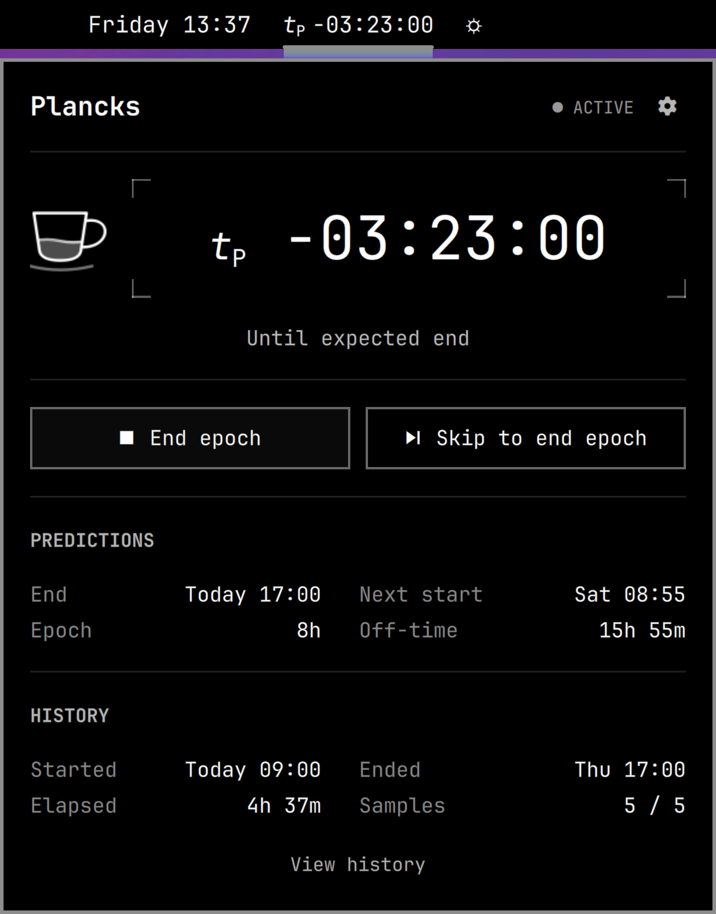
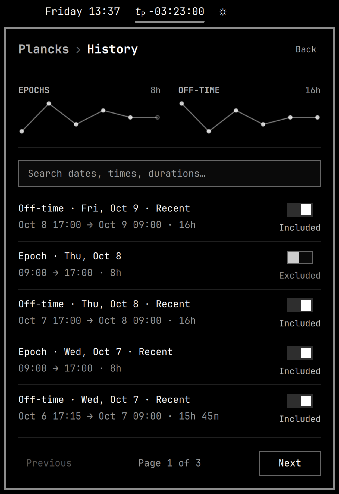
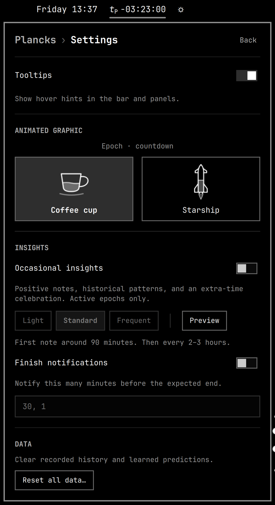

[](https://github.com/gregl83/omarchy-plancks/actions/workflows/ci.yml)
[](https://github.com/gregl83/omarchy-plancks/releases/latest)
[](https://github.com/gregl83/omarchy-plancks/blob/main/LICENSE)

# Plancks

**A second clock, tuned to your daily rhythm.**

Plancks sits alongside your standard clock in the Omarchy bar, tracking your daily opportunity window and predicting what comes next. Standard clocks keep people in sync; Plancks helps you understand your own daily rhythm.

<p align="center">
  
  
  
  <br>
  <em>Preview with sample history.</em>
</p>

An **epoch** is your window of available opportunity; **off-time** is the interval between epochs. Start an epoch when you get out of bed or sign in to work, and end it when you go to bed or sign out—usually once each per day.

Plancks learns from recent epochs and off-time intervals to predict when your current epoch will end and when the next one will start. The window includes normal breaks and interruptions; it measures available opportunity, not continuous productive effort.

The widget renders Planck-time notation as italic **t** with an upright subscript capital **P**, equivalent to `t_P`. Durations are ordinary hours, minutes, and seconds.

The bar and panel timer use normal text for an active epoch and Omarchy's standard dimmed styling for off-time. The tooltip, accessible label, and panel name the phase explicitly.

Choose **Coffee cup** or **Starship** in Settings. Starship fills its fuel tank on the launch pad during off-time, then drains with a flickering nozzle flame during an active epoch. While learning, it shows a pulsing fuel connection on the pad or a flame during an epoch, without a fuel level. Past the expected time, the tank stays full on the pad during off-time, or empty with the flame off during an active epoch.

The main panel frames the timer with subtle corner brackets, with a small coffee cup aligned to the left outside the brackets. During an active epoch it empties toward the expected end; during off-time it fills toward the expected next start. Past zero, the cup stays empty during an active epoch or full during off-time; the positive timer shows how far past the expected time you are. While learning without a prediction, steam rises without a fill level. Animations run only while the timer panel is open.

| Appearance | Example | Meaning |
| --- | --- | --- |
| Normal | `t_P −02:00:00` | Two hours until the current epoch is expected to end |
| Normal | `t_P +00:15:00` | The current epoch is still active, fifteen minutes after its expected end time |
| Dimmed | `t_P −02:00:00` | Two hours until the next epoch is expected to start |
| Dimmed | `t_P +00:15:00` | The next epoch has not started, and its expected start time was fifteen minutes ago |

The timer descriptions use **Until expected epoch end** / **Since expected epoch end** while an epoch is active, and **Until expected next epoch start** / **Since expected next epoch start** during off-time.

Starting or ending an epoch changes its active/off-time appearance; passing an expected time does not. Resetting also returns the widget to off-time. Storage errors show an undimmed `!` marker. Click the widget to open its panel, then use **Start epoch** / **End epoch**. The panel groups forecasts under **Predictions** and actual timestamps, elapsed time, and sample counts under **History**. Open **Settings** using the gear in the main panel’s header. The **Animated graphic** section selects one graphic for the timer. Options appear two per row and preview ready, learning, countdown, and overrun states together in a sped-up loop, with one shared state caption above the tiles; the selected option is saved across restarts. The **Tooltips** switch controls hover hints in the bar and both panels; its preference is saved across restarts. Hover details for full timestamps and durations; the Samples tooltip explains the epoch/off-time counts and which intervals qualify for predictions. Select **View history** below the History details to browse completed epochs and off-time intervals, five per page. Compact epoch and off-time trends show the latest ten completed intervals of each kind, independently of pagination. Charts disappear when there is no valid data; hover points for details, and hollow points mark excluded intervals. The **Included** / **Excluded** switch controls whether each interval is eligible for learning; skipped intervals can be included again. Recent eligible samples are marked, while intervals invalidated by backwards clock changes remain excluded. Changes save immediately and recalculate the current prediction when its sample window changes, keeping the original start time. The **Plancks › History** header identifies the page; select **Plancks**, select **Back**, or press Escape to return to the main panel. Tab moves between buttons, and Enter or Space activates the focused button. With focus on the panel itself, Enter or Space starts or ends an epoch (or retries a storage error). Escape closes the panel, or cancels an open reset confirmation.

## Insights

Settings has two independent, optional notification controls. Both start off. **Occasional insights** offers concise, positive encouragement, historical observations, and one extra-time celebration. **Finish notifications** defaults to 30 minutes and 1 minute before the expected end; edit the comma-separated minute values to choose up to six thresholds. Alerts appear as normal desktop notifications while an epoch is active. Off-time is quiet. **Preview**, beside the frequency choices, sends a sample note through the same desktop notification path as scheduled alerts. It works even with notifications disabled or during off-time, without changing history or delivery progress. Repeated previews remember recent samples for the current shell session, varying the observation and wording independently of scheduled alerts.

The first occasional note is scheduled 90–105 minutes into an epoch. Subsequent spacing varies randomly: **Light** every 3–4 hours, **Standard** every 2–3 hours, or **Frequent** every 1–2 hours. Passing the prediction produces one positive extra-time note after about 90 seconds, and occasional notes continue. Finish warnings take priority over occasional notes; closely spaced alerts are separated by a two-minute cooldown. Missed alerts after suspend or restart are skipped rather than delivered in a burst. Enabling notifications midway through an epoch does not send past warnings.

The local catalog varies both wording and meaning, remembering recent messages and the historical facts already shown. Eligible observations include completed-epoch milestones, improving start-time consistency, steady epoch lengths, monthly opportunity totals, earlier starts, morning patterns, monthly duration records, and forecast accuracy. Statistics use valid, included history; monthly totals count completed epochs that started in the current local calendar month. Time recorded describes opportunity, not work accomplished. Forecast accuracy compares the prediction saved at completion with the actual finish, using predictions saved with newly completed epochs; older entries without that information are omitted.

Scheduling runs in the existing Python helper. Ordinary ticks check an in-memory deadline; historical aggregates rebuild only when history changes. Delivery progress is saved atomically at scheduling or notification events, preventing duplicate delivery across restarts and helper instances. `notify-send` runs briefly for each actual alert; there is no additional resident process or network dependency. Insight errors appear in Settings without stopping the clock.

## Install

Requires an Omarchy release with the Quickshell plugin system and shared `qs.Ui` components, plus Python 3.9 or later. The plugin uses only Python's standard library. It does not support the older Waybar shell.

Install through Omarchy:

```bash
omarchy plugin add https://github.com/gregl83/omarchy-plancks.git --enable
omarchy bar move gregl83.plancks --after omarchy.clock
```

Omarchy creates the plugin directory, clones the repository, validates it, and enables the widget. Plancks creates its runtime storage automatically. There are no directories to create manually. The manifest defaults to the center section; the second command places the widget immediately after the clock.

### Update

For a Git-based installation:

```bash
omarchy plugin update gregl83.plancks
omarchy restart shell
```

Restarting the shell loads the updated shared controller and Python helper. Your saved history survives the restart. Copy-only development installations use the copy procedure below instead.

### Try a local checkout without publishing

After committing the plugin files locally, run these commands from the repository:

```bash
omarchy plugin add "$PWD" --enable
omarchy bar move gregl83.plancks --after omarchy.clock
```

Omarchy clones the local Git repository, so only committed files are included. Nothing is published. To pull subsequent local commits into that installed copy:

```bash
omarchy plugin update gregl83.plancks
```

### Test uncommitted development changes

From the repository directory, validate and copy the runtime files to try edits without committing:

```bash
omarchy plugin validate .
mkdir -p ~/.config/omarchy/plugins/gregl83.plancks
cp manifest.json qmldir Widget.qml EpochPanel.qml EpochController.qml HistoryView.qml HistoryTrend.qml AnimatedGraphic.qml CoffeeGraphic.qml StarshipGraphic.qml GraphicPreview.qml InsightsSettings.qml Graphics.js plancks.py insights.py \
  ~/.config/omarchy/plugins/gregl83.plancks/
omarchy-shell shell rescanPlugins
omarchy plugin enable gregl83.plancks --after omarchy.clock
```

Repeat the copy step after editing. QML widget and panel changes hot-reload, but the shared controller and its long-running Python helper can survive plugin rescans. After changing `plancks.py`, `insights.py`, or `EpochController.qml`, restart the shell to load the new code:

```bash
omarchy restart shell
```

This briefly reloads the desktop shell; the saved epoch and its timing survive the restart. This manual copy method is for development. A copy-only installation receives updates by copying again, rather than through Git.

## Learning your daily rhythm

With no history and the default settings, the first epoch counts up from `+00:00:00`. The first off-time interval does the same, starting when you end that epoch. Without a prediction, `+` means elapsed time in the current phase; the tooltip and panel show “Epoch elapsed · learning your rhythm” or “Off-time elapsed · learning your rhythm.” Once a prediction exists, `+` means time since the expected epoch end or next epoch start. Before the first epoch starts, or immediately after a reset, the timer shows `--:--:--` because no interval has started yet.

For each prediction, Plancks uses up to five recent completed intervals of that kind. With five samples, it drops one shortest and one longest and averages the remaining three. Epoch and off-time histories are independent. With one or two samples, it uses their mean; with three or four, it drops the extremes and averages what remains. Predictions round to whole seconds with a one-second minimum.

A daily window of 07:00–23:00 teaches a 16-hour epoch duration. Starting again at 07:00 teaches eight hours of off-time. A workday sign-in/sign-out routine learns its own durations with the same model.

While active, the next-start forecast uses the expected end plus expected off-time. Ending the epoch anchors that forecast to the actual end. The current phase's expected duration stays fixed until you start or end an epoch, including after shell reloads. Late starts and overruns do not change phase automatically.

Settings live inline on the widget's entry in Omarchy's `shell.json`. To supply an initial eight-hour epoch estimate before any history exists:

```bash
omarchy bar set gregl83.plancks initialSeconds 28800 --json
```

The default `initialSeconds` is `0` (learn first); an initial estimate must be at least one second. Changing it affects future starts without history; it does not change an active epoch. The optional `rotateBytes` setting defaults to `5242880` (5 MiB).

### Skip unusual periods

The skip button changes phase while excluding the period you are leaving from prediction learning. Its timestamps and duration stay recorded.

| Action | Period excluded |
| --- | --- |
| **Skip to start epoch** | Off-time since the last epoch ended |
| **Skip to end epoch** | The current epoch |

Use **Skip to start epoch** after a weekend, or **Skip to end epoch** when you forgot to stop. If you immediately start again, use both skip actions to exclude the brief gap too. Normal actions resume learning.

Skipped intervals stay in history and can be included again through **View history**.

### History and trends

History shows five intervals per page, with inclusion switches and separate epoch and off-time duration trends. Each chart shows up to ten completed intervals, stays fixed while paging, and disappears without valid data. Changing an interval's inclusion updates relevant predictions while keeping the current interval's original start time.

The search box matches across all completed history before pagination. Search either endpoint's local date or time (`Oct 6`, `October 6`, `2026-10-06`, `09:30`), a duration (`8h 30m`, `8h30m`, `08:30:00`), or labels such as `epoch`, `off-time`, `included`, `excluded`, and `recent`. Matching ignores case, and combined terms narrow the results—for example, `Oct 6 epoch excluded`. Bare numbers make broad matches across dates, times, and durations. Results update as you type; **Clear** restores the full list. With the search field focused, Escape clears a nonempty search and keeps focus in the field; Escape when empty returns to the main panel. Trend graphs continue to show the latest intervals across all history.

## Optional keyboard shortcut

While the widget is enabled and loaded, start or end an epoch without opening its panel:

```bash
omarchy-shell gregl83.plancks toggleEpoch
```

The command uses the same **Start epoch** / **End epoch** action as the panel. Use `omarchy-shell gregl83.plancks toggleEpochSkip` for the skip action. Both return `submitted` when the action is sent to storage, `busy` while an action is pending, or `not-ready` when storage is loading or unavailable. `submitted` does not mean the action has been saved yet. Any storage failure appears in the widget and panel, where you can select **Retry**.

To assign **Super+Alt+P**, first check for conflicts with `omarchy menu keybindings --print`, then add this optional binding to `~/.config/hypr/bindings.lua`:

```lua
o.bind("SUPER + ALT + P", "Plancks: Start/end epoch", "omarchy-shell gregl83.plancks toggleEpoch")
o.bind("SUPER + ALT + SHIFT + P", "Plancks: Skip to start/end epoch", "omarchy-shell gregl83.plancks toggleEpochSkip")
```

Choose an unused combination, or explicitly unbind an existing assignment before replacing it. Validate the configuration with `hyprctl reload` and `hyprctl configerrors`. The plugin installer does not install keybindings automatically. After updating the controller in an existing installation, run `omarchy restart shell` to register the new IPC action.

## Reset all data

Open the widget panel, select **Settings**, then **Reset all data…** in the **Data** section. A warning explains what will be deleted; **Cancel** is focused by default. Select **Delete all data** to permanently delete recorded epochs, off-time intervals, and learned predictions and discard any active epoch. Escape cancels the confirmation. Reset cannot be undone; back up the [storage directory](#persistence-and-recovery) first if you want to keep your history.

The widget returns to its initial off-time state and learns again from new epochs. Widget settings (`initialSeconds`, `rotateBytes`, and bar placement) stay intact. Reset is also available when damaged history prevents starting or ending an epoch. Other instances of the widget refresh automatically. Reset requires writable storage and valid reset metadata; it cannot repair filesystem permissions or a damaged `events/.reset.json` file.

## Remove

To delete your recorded epochs and learned predictions, use [Reset all data](#reset-all-data) **before uninstalling**. Otherwise, saved history remains in the [storage directory](#persistence-and-recovery) for a future reinstall.

Remove the plugin with:

```bash
omarchy plugin remove gregl83.plancks
```

If you added the optional keyboard shortcut, remove the `o.bind(...)` entry containing `omarchy-shell gregl83.plancks toggleEpoch` from `~/.config/hypr/bindings.lua`. Then reload and check the configuration:

```bash
hyprctl reload
hyprctl configerrors
```

## Persistence and recovery

Plancks stores data locally and makes no network requests. It starts one Python helper shared by the widget instances; it requires no account or elevated permissions.

Runtime history lives at `$XDG_STATE_HOME/omarchy/gregl83.plancks/`, falling back to `~/.local/state/omarchy/gregl83.plancks/`. A relative XDG path is ignored.

- `events/events-00000001.jsonl`, etc.: append-only start/end and history inclusion-change records, rotated before the next record exceeds the segment limit. All segments are retained until you reset the data. One record may exceed a very small configured limit.
- `state.json`: the single mutable snapshot, replaced atomically after a durable journal append. Includes phase, clock anchors, the current prediction, recent samples, complete interval history, and replay position.
- `events/.reset.json`: a reset token and completion flag, containing no epoch history. It prevents stale commands and duplicate reset retries from deleting new history and allows interrupted deletion to finish on recovery.
- `insights.json` and `insights.lock`: optional notification deadlines, delivery IDs, recent wording/facts, and coordination. Created when notifications are enabled during an active epoch and cleared by Reset all data.
- `.lock`: an empty coordination file for serializing helper instances; it contains no epoch state.

The journal is authoritative. Plancks replays and validates it on startup or when its files change, then caches the result in memory. A missing or damaged snapshot is rebuilt. An incomplete final record is preserved and the next append goes into a new segment. Malformed complete records or missing segments block updates and display an error. Back up the entire directory together; ordinary journal recovery never deletes history. Once a reset is confirmed, recovery finishes any interrupted deletion.

Ordinary one-second updates use cached state and predictions: they do not scan, read, lock, or write history files. An in-process Linux inotify watch detects journal changes without another watcher process. The helper sends only changed timer/status fields; elapsed details update while a panel is open. Before there is any running display to update, it sleeps until a command or file change. Multiple monitor widgets share a controller, and storage also locks and checks revisions to reject stale commands. If storage fails, the panel reports the failure and offers **Retry**; retries reuse the request ID to avoid recording an action twice.

Elapsed time includes suspend and uses Linux's suspend-inclusive monotonic clock within a boot. Across reboots it falls back to UTC timestamps; a backwards interval is flagged and excluded from learning. An active epoch stays active through suspend, shutdown, and midnight until you end it or reset the data. Long absences, including weekends, are included in off-time samples unless you use **Skip to start epoch**. Plancks has no automatic schedule or timestamp correction. History inclusion changes are appended to the journal without rewriting original intervals.

## Development checks

```bash
python3 -m unittest discover -s tests -v
omarchy plugin validate .
python3 tests/smoke_qml.py
```

The QML smoke check needs an active Wayland session and the installed Omarchy shell. It uses temporary storage and does not change the live bar. Add `--preview` to briefly show the test widget and panel. It checks two widgets sharing epoch state through IPC, busy/not-ready guards, normal and skip transitions, overrun, vertical layout, and reset. With `--preview` (also used in CI), it exercises history navigation, inclusion switches, pagination, trends and their empty-state behavior, plus the reset warning, default Cancel focus, Cancel activation, Escape cancellation, and explicit deletion through keyboard input. Physical suspend/reboot still warrant a live-session check.

Regenerate all three README previews in `assets/` with `python3 scripts/preview.py` in an active Wayland session. It renders the production panels with isolated, frozen sample history, preserves the preview’s bar framing and background strip, and leaves your saved history untouched.

## CI and releases

The `ci` workflow validates pull requests targeting `main`, pushes to `main`, and `v*` tags. It runs the Python tests on Python 3.9 and 3.14, checks package metadata, validates the plugin with Omarchy's official validator, and loads the QML in an isolated headless Wayland session. Plancks ships as Python and QML source, so there is no separate compilation step.

The QML job uses the Omarchy revision in `scripts/ci/omarchy-ref` and the Arch Linux package snapshot selected by `ARCH_SNAPSHOT` in `scripts/ci/Containerfile`. Update these pins deliberately when adopting newer shell components or Qt/Quickshell packages, and verify the headless smoke test before merging. To block merging failed PRs, configure a GitHub branch ruleset for `main` that requires **all systems go**. The workflow supplies that check; repository rules enforce it.

To release:

1. Update `manifest.json` to the new stable `MAJOR.MINOR.PATCH` version and merge the changes into `main` through a passing PR.
2. Check out the latest `main`, then create and push the matching tag:

   ```bash
   git switch main
   git pull --ff-only origin main
   version=$(python3 -c 'import json; print(json.load(open("manifest.json"))["version"])')
   git tag -a "v$version" -m "Plancks v$version"
   git push origin "v$version"
   ```

3. The tag runs the same validation again. Its version must match the manifest, and its commit must belong to `main`. Only after every check passes does the workflow create the GitHub release with generated release notes.

Use the tag workflow to publish releases; manually creating a release in GitHub bypasses this gate. Existing releases are left unchanged on reruns. The release badge shows the latest published GitHub release once the first release exists.

Marketplace submission and approval are separate from this workflow. Omarchy's Git-based installer follows the repository's current code, not the release badge or tag, so protect `main` as well as validating releases.

## License

[Apache 2.0](LICENSE)
